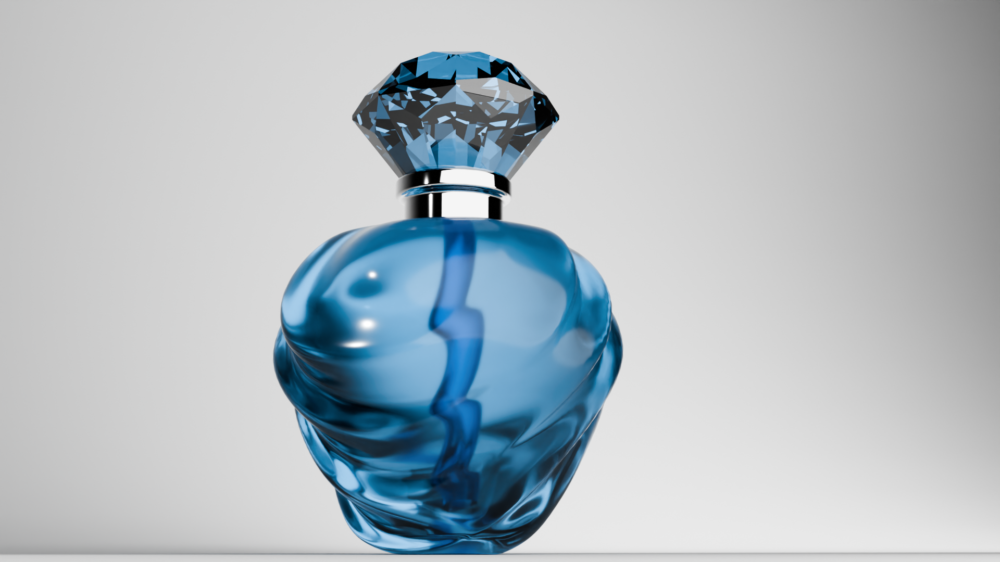

# Fancy Perfume Bottle Product Design

## Project Overview

This Blender project focuses on designing a luxurious and visually striking perfume bottle using advanced modeling and texturing techniques. The aim is to create a high-end product design that captures elegance and sophistication, making it suitable for product visualization, marketing, and promotional purposes.

## Features

- **Elegant Design**: A meticulously crafted perfume bottle with a unique and stylish shape.
- **High-Quality Materials**: Use of glass, metal, and other materials to achieve a realistic and luxurious appearance.
- **Customizable Elements**: Ability to change colors, materials, and design features to create various versions of the bottle.

## Customization

This project allows for extensive customization to suit different branding and design needs. Key customizable elements include:

- **Bottle Shape**: Adjust the overall shape and structure of the bottle to create unique designs.
- **Materials**: Change the type of glass, metal, and other materials to achieve different looks and finishes.
- **Colors**: Customize the colors of the bottle, cap, and other elements to fit various styles.
